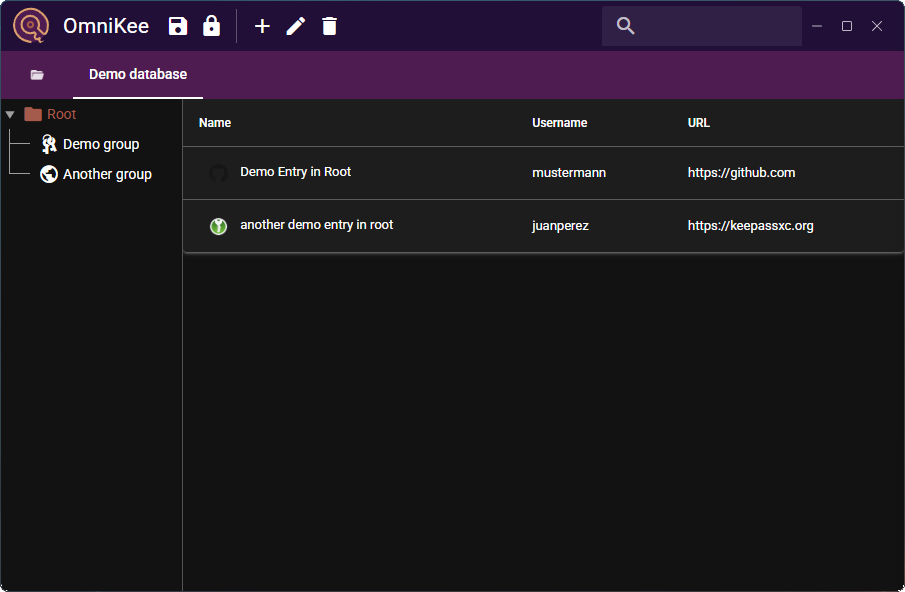

#  OmniKee

A cross-platform1, KeePass-compatible password manager that runs on Linux, MacOS, Windows, Android, and your web browser. Written in memory-safe Rust and TypeScript code. Powered by [Tauri](https://v2.tauri.app/), [wasm-pack](https://github.com/rustwasm/wasm-pack), [Quasar](https://quasar.dev/), [Vite](https://vite.dev/), and [Vue](https://vuejs.org/).

[Try in your Browser](https://omnikee.github.io/OmniKee) | [Download](https://github.com/OmniKee/OmniKee/releases/latest) | [Docs](https://omnikee.github.io)

1 iOS could be supported in principle, but currently isn't - contributors wanted!

